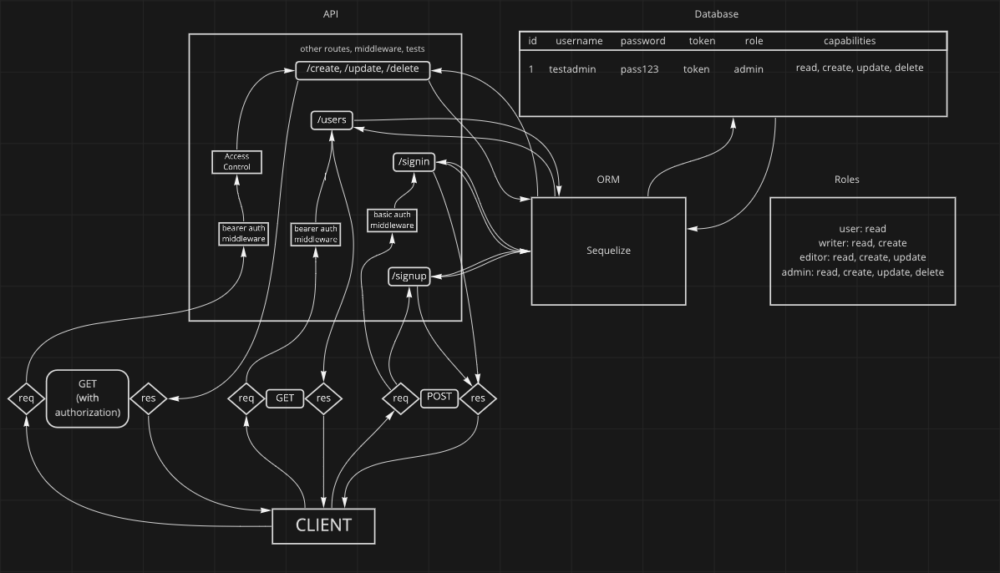

# LAB - Class 09

[Project: Partner Project - ToDo Manager](https://github.com/abditake/Auth-module-final-project)

## Author: Abdinasir Yussuf, Dylan Ulrich

## Problem Domain

Creating a Task Management system that utilizes Role Based Access Controls.

- [Prod url](https://ay-du-auth-module-project-prod.herokuapp.com/)
- [GitHub Repo](https://github.com/abditake/Auth-module-final-project)

`.env` requirements

- `PORT` - Port Number

### How to initialize/run the application

- `nodemon` to start

### UML

